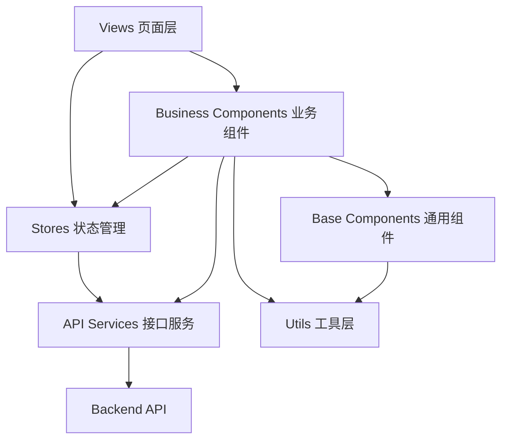
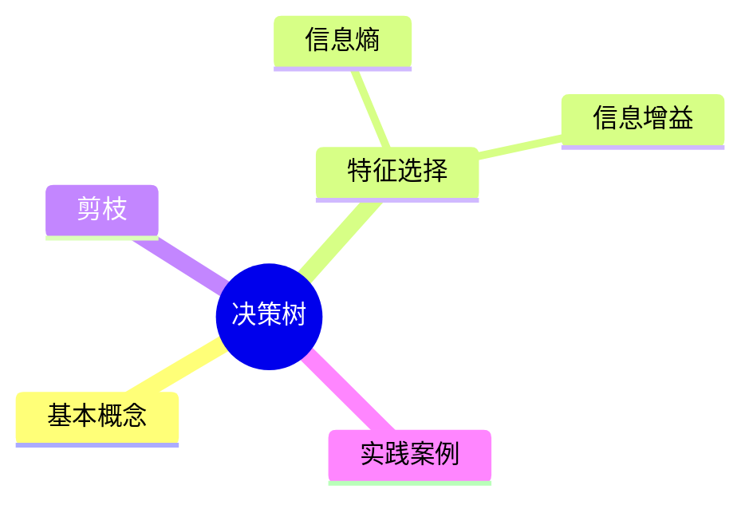

# 智学工坊 EduAgent Studio 前端详细技术开发文档

> 适用项目：基于大模型的个性化资源生成与学习多智能体系统  
> 前端技术栈：Vue 3 + TypeScript + Vite  
> 文档版本：V1.0  
> 编制日期：2026 年 4 月 30 日  
> 参考文档：技术开发文档.md

## 1. 文档目的

本文档用于指导“智学工坊 EduAgent Studio”前端应用的详细设计、开发、联调、测试和部署。文档重点说明前端技术选型、项目结构、路由设计、页面设计、组件设计、状态管理、接口封装、流式输出、任务进度、多模态资源展示、权限控制、异常处理、性能优化和测试规范。

本文档面向前端开发人员、后端联调人员、测试人员和参赛演示材料制作人员。

## 2. 前端建设目标

1. 构建学生端、管理端和比赛演示端三个核心前端入口。
2. 支持对话式学生画像构建，展示画像抽取、确认和更新过程。
3. 支持大模型流式输出、Markdown 渲染、代码高亮和知识来源引用展示。
4. 支持多智能体执行进度展示，使系统协同过程可视化。
5. 支持至少 5 类个性化学习资源的卡片化展示。
6. 支持学习路径时间线、学习效果图表和测评反馈展示。
7. 支持课程知识库管理、文档上传、解析状态查看和资源审核。
8. 提供适合比赛答辩的一键演示流程页面。
9. 保证界面简洁、交互清晰、响应及时，符合现代 AI 产品使用体验。

## 3. 技术选型

| 分类 | 技术 | 用途 |
| --- | --- | --- |
| 构建工具 | Vite | 前端工程构建与本地开发服务 |
| 前端框架 | Vue 3 | 页面与组件开发 |
| 开发语言 | TypeScript | 类型约束，提高维护性 |
| 路由 | Vue Router | 页面路由与权限守卫 |
| 状态管理 | Pinia | 用户、画像、任务、资源等状态管理 |
| HTTP 请求 | Axios | REST API 请求封装 |
| 流式通信 | EventSource / fetch stream | 大模型流式输出与任务进度订阅 |
| UI 组件库 | Element Plus | 表格、表单、弹窗、上传、步骤条等基础组件 |
| 图标 | Element Plus Icons / lucide-vue-next | 操作按钮与状态图标 |
| Markdown | markdown-it / md-editor-v3 | 渲染生成文档和问答内容 |
| 代码高亮 | highlight.js / shiki | 展示代码案例和解释 |
| 图表 | ECharts | 画像雷达图、学习效果图、资源统计图 |
| 思维导图 | Mermaid / markmap | 知识点结构图与生成导图 |
| 样式 | CSS Variables + SCSS | 主题变量与页面样式 |
| 测试 | Vitest + Vue Test Utils | 单元测试与组件测试 |
| E2E 测试 | Playwright | 演示链路与关键流程测试 |

## 4. 前端总体架构

### 4.1 架构分层

前端采用“页面层 + 业务组件层 + 通用组件层 + 状态管理层 + API 服务层 + 工具层”的结构。



### 4.2 应用入口

系统前端包含三个主要业务入口：

1. 学生端  
   面向学生使用，提供画像构建、资源生成、学习路径、智能辅导、测评反馈等功能。

2. 管理端  
   面向教师或管理员使用，提供课程知识库、文档解析、生成任务、资源审核、模型配置和用户数据查看。

3. 演示端  
   面向比赛答辩使用，提供固定示例数据和一键式演示流程，突出系统功能闭环与多智能体协作过程。

## 5. 项目目录结构

建议前端目录结构如下：

```text
frontend/
  package.json
  vite.config.ts
  tsconfig.json
  index.html
  .env.development
  .env.production
  src/
    main.ts
    App.vue
    assets/
      styles/
        variables.scss
        global.scss
        markdown.scss
      images/
    api/
      request.ts
      auth.ts
      profile.ts
      course.ts
      knowledge.ts
      resource.ts
      task.ts
      learningPath.ts
      tutor.ts
      assessment.ts
      admin.ts
    components/
      base/
        BasePage.vue
        BaseToolbar.vue
        BaseEmpty.vue
        BaseLoading.vue
        BaseStatusTag.vue
      chat/
        ChatPanel.vue
        ChatMessage.vue
        ChatInput.vue
        StreamRenderer.vue
      profile/
        ProfileCard.vue
        ProfileRadar.vue
        ProfileConfirmDialog.vue
      agent/
        AgentProgress.vue
        AgentTimeline.vue
        AgentStatusNode.vue
      resource/
        ResourceCard.vue
        ResourceViewer.vue
        MarkdownViewer.vue
        MindMapViewer.vue
        ExerciseViewer.vue
        CodeLabViewer.vue
        VideoScriptViewer.vue
        SourceCitation.vue
        SafetyBadge.vue
      learning/
        LearningPathTimeline.vue
        LearningStepCard.vue
        StudyReportPanel.vue
      assessment/
        QuestionCard.vue
        AssessmentPanel.vue
        AnswerAnalysis.vue
    layouts/
      StudentLayout.vue
      AdminLayout.vue
      DemoLayout.vue
    router/
      index.ts
      guards.ts
      routes.student.ts
      routes.admin.ts
      routes.demo.ts
    stores/
      auth.ts
      profile.ts
      task.ts
      resource.ts
      learningPath.ts
      course.ts
      app.ts
    types/
      auth.ts
      profile.ts
      course.ts
      resource.ts
      task.ts
      learningPath.ts
      tutor.ts
      assessment.ts
      common.ts
    utils/
      storage.ts
      format.ts
      markdown.ts
      stream.ts
      validation.ts
      download.ts
      error.ts
    views/
      login/
        LoginView.vue
      student/
        DashboardView.vue
        ProfileChatView.vue
        ProfileView.vue
        ResourceGenerateView.vue
        ResourceCenterView.vue
        ResourceDetailView.vue
        LearningPathView.vue
        TutorView.vue
        AssessmentView.vue
      admin/
        AdminDashboardView.vue
        CourseManageView.vue
        DocumentManageView.vue
        TaskManageView.vue
        ResourceAuditView.vue
        ModelConfigView.vue
      demo/
        DemoHomeView.vue
        DemoFlowView.vue
```

## 6. 路由设计

### 6.1 路由表

| 路由 | 页面 | 权限 | 说明 |
| --- | --- | --- | --- |
| `/login` | 登录页 | public | 用户登录 |
| `/student/dashboard` | 学生首页 | student | 学习概览 |
| `/student/profile-chat` | 对话画像页 | student | 对话式画像构建 |
| `/student/profile` | 画像详情页 | student | 查看和维护画像 |
| `/student/resource-generate` | 资源生成页 | student | 生成学习资源 |
| `/student/resources` | 资源中心 | student | 查看资源列表 |
| `/student/resources/:id` | 资源详情页 | student | 查看资源内容 |
| `/student/learning-path` | 学习路径页 | student | 查看学习计划 |
| `/student/tutor` | 智能辅导页 | student | 学习问答 |
| `/student/assessment` | 测评页 | student | 练习与测试 |
| `/admin/dashboard` | 管理首页 | teacher/admin | 统计概览 |
| `/admin/courses` | 课程管理 | teacher/admin | 课程与知识点维护 |
| `/admin/documents` | 文档管理 | teacher/admin | 上传和解析课程资料 |
| `/admin/tasks` | 任务管理 | teacher/admin | 查看生成任务 |
| `/admin/audit` | 资源审核 | teacher/admin | 审核生成资源 |
| `/admin/model-config` | 模型配置 | admin | 管理提示词与模型配置 |
| `/demo` | 演示首页 | public / demo | 比赛演示入口 |
| `/demo/flow` | 演示流程页 | public / demo | 一键演示核心流程 |

### 6.2 路由守卫

路由守卫处理：

1. 未登录用户访问受保护页面时跳转 `/login`。
2. 登录后根据角色进入对应首页。
3. 学生不能访问管理端页面。
4. 教师可以访问课程、文档、审核和统计页面。
5. 管理员可以访问模型配置。
6. 演示页可配置为免登录或使用固定演示 Token。

## 7. 页面详细设计

### 7.1 登录页

路径：`/login`

功能：

1. 用户名密码登录。
2. 演示账号快速登录。
3. 根据角色跳转学生端或管理端。
4. 登录失败时显示错误提示。

核心接口：

| 接口 | 说明 |
| --- | --- |
| `POST /api/auth/login` | 登录 |
| `GET /api/auth/me` | 获取当前用户 |

### 7.2 学生首页

路径：`/student/dashboard`

功能：

1. 展示当前学习课程、学习进度和近期任务。
2. 展示推荐资源和待完成测评。
3. 展示画像摘要、学习路径摘要和学习效果摘要。
4. 提供“继续学习”“生成资源”“智能辅导”等快捷入口。

页面布局：

1. 顶部：当前课程、学习目标、快捷操作。
2. 左侧主体：学习路径进度、推荐资源。
3. 右侧信息栏：画像摘要、测评结果、智能体任务状态。

### 7.3 对话画像页

路径：`/student/profile-chat`

功能：

1. 学生通过自然语言描述专业、学习目标、困难、偏好和学习历史。
2. 前端展示对话消息和模型流式回复。
3. 系统返回画像草稿后弹出确认窗口。
4. 学生可确认、修改或拒绝画像维度。
5. 确认后的画像写入正式画像列表。

核心组件：

| 组件 | 职责 |
| --- | --- |
| `ChatPanel` | 对话容器 |
| `ChatMessage` | 消息气泡 |
| `ChatInput` | 输入框与发送按钮 |
| `ProfileConfirmDialog` | 画像确认弹窗 |
| `ProfileCard` | 画像结果展示 |

核心接口：

| 接口 | 说明 |
| --- | --- |
| `POST /api/profile/dialog` | 提交画像对话 |
| `POST /api/profile/extract` | 抽取画像草稿 |
| `POST /api/profile/confirm` | 确认画像 |
| `GET /api/profile/me` | 获取画像 |

### 7.4 画像详情页

路径：`/student/profile`

功能：

1. 展示 8 个画像维度：专业背景、知识基础、学习目标、学习进度、认知风格、资源偏好、易错知识点、实践能力水平。
2. 使用雷达图、标签、置信度条展示画像状态。
3. 支持手动修改画像维度。
4. 展示画像来源和更新时间。

视觉要求：

1. 画像维度以卡片或紧凑列表展示。
2. 置信度低的画像项使用提示标记。
3. 对“系统推断”的画像提供确认入口。

### 7.5 资源生成页

路径：`/student/resource-generate`

功能：

1. 输入学习主题、学习目标和当前困难。
2. 选择资源类型：讲解文档、思维导图、练习题、拓展阅读、实操案例、视频脚本。
3. 展示学生画像引用信息。
4. 创建生成任务，并展示多智能体执行进度。
5. 任务完成后展示生成资源卡片。

核心交互：

1. 用户提交生成请求。
2. 前端调用 `/api/resources/generate` 创建任务。
3. 前端通过 `/api/tasks/{id}` 轮询或 SSE 订阅任务状态。
4. `AgentProgress` 展示当前智能体和进度。
5. 任务完成后跳转资源详情或在当前页展示结果。

### 7.6 资源中心

路径：`/student/resources`

功能：

1. 按课程、资源类型、审核状态、创建时间筛选资源。
2. 展示资源卡片，包括标题、类型、摘要、引用数、审核状态、质量评分。
3. 支持查看详情、导出、反馈和重新生成。

资源类型展示：

| 类型 | 展示组件 |
| --- | --- |
| 讲解文档 | `MarkdownViewer` |
| 思维导图 | `MindMapViewer` |
| 练习题 | `ExerciseViewer` |
| 拓展阅读 | `MarkdownViewer` |
| 实操案例 | `CodeLabViewer` |
| 视频脚本 | `VideoScriptViewer` |

### 7.7 资源详情页

路径：`/student/resources/:id`

功能：

1. 展示资源完整内容。
2. 展示知识来源引用。
3. 展示审核状态、质量评分和风险提示。
4. 支持复制内容、导出 Markdown、导出 PDF。
5. 支持提交反馈：有用、太难、太简单、不准确、需要更多案例。

### 7.8 学习路径页

路径：`/student/learning-path`

功能：

1. 展示阶段化学习计划。
2. 每个阶段包含知识点、推荐资源、预计时长、练习任务和验收标准。
3. 支持标记阶段完成。
4. 展示路径调整记录。
5. 根据测评结果提示下一步学习建议。

核心组件：

| 组件 | 职责 |
| --- | --- |
| `LearningPathTimeline` | 学习路径时间线 |
| `LearningStepCard` | 阶段任务卡片 |
| `StudyReportPanel` | 学习效果报告 |

### 7.9 智能辅导页

路径：`/student/tutor`

功能：

1. 支持围绕当前课程进行即时问答。
2. 支持对资源内容追问。
3. 支持代码解释和错题解析。
4. 回答中展示引用来源和置信度提示。
5. 对无法回答的问题提示补充资料。

交互要求：

1. 使用聊天界面。
2. 支持流式输出。
3. 支持选择“文字解释、图解说明、代码解释、视频脚本”回答形式。
4. 支持将问答结果保存为学习笔记。

### 7.10 测评页

路径：`/student/assessment`

功能：

1. 根据当前学习路径生成练习题。
2. 支持选择题、填空题、简答题、编程题展示。
3. 支持提交答案并展示得分、解析和错因。
4. 将测评结果反馈给学习路径模块。

### 7.11 管理端课程管理页

路径：`/admin/courses`

功能：

1. 创建、编辑和归档课程。
2. 管理章节和知识点。
3. 设置知识点难度和先修关系。
4. 查看课程资源统计。

### 7.12 管理端文档管理页

路径：`/admin/documents`

功能：

1. 上传 PDF、Word、PPT、Markdown、TXT 等课程文档。
2. 查看文档解析状态。
3. 查看切片结果和引用来源。
4. 触发重新解析。

### 7.13 管理端资源审核页

路径：`/admin/audit`

功能：

1. 查看待审核资源列表。
2. 查看生成内容、引用来源、审核评分和风险提示。
3. 支持通过、驳回、修改后通过。
4. 支持标记内容问题类型：事实错误、引用不足、表达不清、安全风险。

### 7.14 比赛演示页

路径：`/demo/flow`

功能：

1. 固定示例学生和示例课程。
2. 一键填入示例输入。
3. 展示画像抽取、多智能体协作、资源生成、学习路径、测评反馈全过程。
4. 支持重置演示数据。
5. 支持隐藏复杂管理控件，突出核心效果。

演示流程：

1. 输入“我是计算机专业大二学生，想学习决策树……”
2. 展示画像维度。
3. 展示多智能体执行进度。
4. 展示 5 类以上资源卡片。
5. 展示学习路径时间线。
6. 展示测评错因和路径调整建议。

## 8. 组件详细设计

### 8.1 `ChatPanel`

用途：统一承载画像对话、智能辅导和资源追问。

Props：

| 名称 | 类型 | 说明 |
| --- | --- | --- |
| `messages` | `ChatMessage[]` | 消息列表 |
| `loading` | `boolean` | 是否正在回复 |
| `placeholder` | `string` | 输入框提示 |
| `mode` | `'profile' \| 'tutor' \| 'resource'` | 对话模式 |

Events：

| 名称 | 说明 |
| --- | --- |
| `send` | 用户发送消息 |
| `stop` | 停止流式输出 |
| `clear` | 清空对话 |

### 8.2 `AgentProgress`

用途：展示多智能体协作状态。

展示内容：

1. 总体进度。
2. 当前执行智能体。
3. 每个智能体的状态：等待中、执行中、已完成、失败。
4. 智能体输出摘要。
5. 失败重试入口。

状态映射：

| 后端状态 | 前端展示 |
| --- | --- |
| `pending` | 等待中 |
| `running` | 执行中 |
| `success` | 已完成 |
| `failed` | 失败 |
| `cancelled` | 已取消 |

### 8.3 `ResourceCard`

用途：展示学习资源摘要。

字段：

| 字段 | 说明 |
| --- | --- |
| `title` | 资源标题 |
| `resourceType` | 资源类型 |
| `summary` | 资源摘要 |
| `auditStatus` | 审核状态 |
| `qualityScore` | 质量评分 |
| `citationCount` | 引用数量 |
| `createdAt` | 创建时间 |

操作：

1. 查看详情。
2. 导出。
3. 提交反馈。
4. 重新生成。

### 8.4 `MarkdownViewer`

用途：渲染讲解文档、拓展阅读、学习报告等 Markdown 内容。

要求：

1. 支持标题、列表、表格、代码块、引用。
2. 支持数学公式时可接入 KaTeX。
3. 支持代码高亮。
4. 支持复制代码。
5. 支持内部 Mermaid 图表渲染。

### 8.5 `MindMapViewer`

用途：展示知识点思维导图。

实现方式：

1. 优先支持 Mermaid `mindmap` 或 `flowchart`。
2. 若生成内容为 JSON 树结构，可转换为 markmap 展示。
3. 渲染失败时展示原始 Markdown，并提示重新生成。

### 8.6 `ExerciseViewer`

用途：展示分层练习题。

支持题型：

1. 单选题。
2. 多选题。
3. 填空题。
4. 简答题。
5. 编程题。

功能：

1. 展示难度、知识点和题目类型。
2. 支持展开答案与解析。
3. 支持加入测评。
4. 支持标记错题。

### 8.7 `CodeLabViewer`

用途：展示代码实操案例。

功能：

1. 展示实验目标、环境要求、步骤、代码和运行结果说明。
2. 支持代码高亮和复制。
3. 支持按步骤折叠展示。
4. 支持下载代码片段。

### 8.8 `VideoScriptViewer`

用途：展示视频或动画讲解脚本。

展示字段：

1. 分镜序号。
2. 画面描述。
3. 旁白文本。
4. 屏幕文字。
5. 推荐素材或动画动作。

## 9. 状态管理设计

### 9.1 Store 划分

| Store | 职责 |
| --- | --- |
| `authStore` | 登录状态、Token、用户信息、角色 |
| `profileStore` | 学生画像、画像草稿、画像确认状态 |
| `courseStore` | 当前课程、课程列表、知识点 |
| `taskStore` | 生成任务、任务进度、智能体状态 |
| `resourceStore` | 资源列表、资源详情、资源反馈 |
| `learningPathStore` | 学习路径、阶段完成状态、调整记录 |
| `appStore` | 全局加载状态、主题、错误信息 |

### 9.2 典型状态结构

```ts
export interface TaskState {
  activeTaskId: string | null
  tasks: Record<string, GenerationTask>
  agentSteps: AgentStep[]
  pollingTimer: number | null
}
```

```ts
export interface ProfileState {
  profileItems: StudentProfileItem[]
  draftItems: StudentProfileItem[]
  lastDialogMessages: ChatMessage[]
  loading: boolean
}
```

## 10. 类型定义

### 10.1 通用响应

```ts
export interface ApiResponse<T> {
  code: number
  message: string
  data: T
}
```

### 10.2 学生画像

```ts
export interface StudentProfileItem {
  id?: string
  dimension: string
  value: string | string[] | Record<string, unknown>
  confidence: number
  source: 'dialog' | 'behavior' | 'assessment' | 'manual'
  status: 'draft' | 'confirmed' | 'rejected'
  updatedAt?: string
}
```

### 10.3 生成任务

```ts
export interface GenerationTask {
  id: string
  taskType: 'profile' | 'resource' | 'path' | 'tutor' | 'assessment'
  status: 'pending' | 'running' | 'success' | 'failed' | 'cancelled'
  progress: number
  currentAgent?: string
  outputPayload?: unknown
  errorMessage?: string
  createdAt: string
  updatedAt: string
}
```

### 10.4 学习资源

```ts
export interface LearningResource {
  id: string
  title: string
  resourceType: 'explanation' | 'mindmap' | 'exercise' | 'reading' | 'lab' | 'video_script'
  content: string | Record<string, unknown>
  citations: SourceCitation[]
  auditStatus: 'pending' | 'passed' | 'warning' | 'rejected'
  qualityScore?: number
  createdAt: string
}
```

### 10.5 引用来源

```ts
export interface SourceCitation {
  documentId: string
  documentName?: string
  sourceLocation: string
  chunkId: string
  contentPreview?: string
}
```

## 11. API 封装设计

### 11.1 请求实例

`src/api/request.ts` 负责：

1. 配置 `baseURL`。
2. 注入 Authorization Token。
3. 统一处理响应结构。
4. 统一处理 401、403、500 等错误。
5. 处理文件上传和下载。

示例：

```ts
import axios from 'axios'

export const request = axios.create({
  baseURL: import.meta.env.VITE_API_BASE_URL,
  timeout: 30000
})

request.interceptors.request.use((config) => {
  const token = localStorage.getItem('access_token')
  if (token) {
    config.headers.Authorization = `Bearer ${token}`
  }
  return config
})
```

### 11.2 API 模块

| 文件 | 职责 |
| --- | --- |
| `auth.ts` | 登录、登出、当前用户 |
| `profile.ts` | 画像对话、抽取、确认、查询 |
| `course.ts` | 课程、章节、知识点 |
| `knowledge.ts` | 文档上传、解析、知识检索 |
| `resource.ts` | 资源生成、资源列表、资源详情、反馈 |
| `task.ts` | 任务查询、取消、进度订阅 |
| `learningPath.ts` | 学习路径生成、查询、调整 |
| `tutor.ts` | 智能问答、代码解释、错题解析 |
| `assessment.ts` | 题目生成、答案提交、报告查询 |

## 12. 流式输出设计

### 12.1 使用场景

1. 对话式画像构建。
2. 智能辅导问答。
3. 资源生成中的单项内容预览。
4. 长文本讲解文档生成。

### 12.2 实现方案

优先使用 Server-Sent Events，接口形态建议：

```text
GET /api/stream/tasks/{taskId}
```

前端实现：

```ts
export function subscribeTaskStream(
  taskId: string,
  onMessage: (data: unknown) => void,
  onError?: (error: Event) => void
) {
  const source = new EventSource(`/api/stream/tasks/${taskId}`)

  source.onmessage = (event) => {
    onMessage(JSON.parse(event.data))
  }

  source.onerror = (error) => {
    source.close()
    onError?.(error)
  }

  return () => source.close()
}
```

### 12.3 前端展示规则

1. 流式文本逐步追加到当前消息。
2. 任务结束时将临时消息转为正式消息。
3. 用户点击停止时关闭连接并调用取消接口。
4. 连接异常时提示“连接中断，可重试或查看任务结果”。
5. 对 Markdown 内容进行节流渲染，避免频繁重绘。

## 13. 任务进度设计

### 13.1 进度展示节点

| 进度 | 展示文案 |
| --- | --- |
| 0-10 | 创建任务 |
| 10-25 | 分析学生画像 |
| 25-40 | 检索课程知识库 |
| 40-55 | 设计资源结构 |
| 55-80 | 生成个性化资源 |
| 80-90 | 内容审核与修正 |
| 90-100 | 保存结果 |

### 13.2 智能体状态展示

`AgentProgress` 使用步骤条或时间线展示：

1. 画像分析智能体。
2. 知识检索智能体。
3. 资源设计智能体。
4. 讲解生成智能体。
5. 题目生成智能体。
6. 案例生成智能体。
7. 多模态脚本智能体。
8. 质量审核智能体。
9. 路径规划智能体。

## 14. 资源展示设计

### 14.1 讲解文档

使用 `MarkdownViewer` 展示，要求支持：

1. 标题目录。
2. 重点概念高亮。
3. 示例块。
4. 代码块。
5. 引用来源。

### 14.2 思维导图

使用 `MindMapViewer` 展示，优先渲染 Mermaid：



### 14.3 练习题

练习题采用结构化 JSON 后渲染为题目卡片。每道题展示：

1. 题型。
2. 难度。
3. 知识点。
4. 题干。
5. 选项或答题区。
6. 答案和解析。

### 14.4 实操案例

代码案例展示为“目标-环境-步骤-代码-运行说明-扩展任务”结构。

### 14.5 视频脚本

视频脚本展示为表格或时间轴，便于演示：

| 镜头 | 画面 | 旁白 | 屏幕文字 |
| --- | --- | --- | --- |
| 1 | 决策树从根节点开始分裂 | 我们可以把决策树理解为一连串判断问题 | 什么是决策树 |

## 15. 权限与安全设计

### 15.1 角色权限

| 角色 | 可访问页面 |
| --- | --- |
| student | 学生端页面 |
| teacher | 管理首页、课程管理、文档管理、资源审核 |
| admin | 所有管理页面和模型配置 |
| demo | 演示页面 |

### 15.2 前端安全措施

1. Token 存储在 localStorage 或 sessionStorage，生产环境可改为 HttpOnly Cookie。
2. 路由守卫检查登录状态和角色权限。
3. 上传文件限制类型和大小。
4. Markdown 渲染前进行 XSS 过滤。
5. 对模型输出的 HTML 默认转义，不直接使用不可信 HTML。
6. 前端不保存任何模型密钥。

## 16. 表单校验

### 16.1 资源生成表单

| 字段 | 校验规则 |
| --- | --- |
| 课程 | 必选 |
| 学习主题 | 必填，2-50 字 |
| 学习目标 | 必填，5-200 字 |
| 资源类型 | 至少选择 1 项，建议默认选择 5 项 |
| 当前困难 | 可选，最多 300 字 |

### 16.2 文档上传表单

| 字段 | 校验规则 |
| --- | --- |
| 课程 | 必选 |
| 文件 | 必选，支持 pdf/docx/pptx/md/txt |
| 文件大小 | 单文件建议不超过 50MB |
| 文档标签 | 可选 |

### 16.3 画像确认表单

| 字段 | 校验规则 |
| --- | --- |
| 画像维度 | 必填 |
| 画像值 | 必填 |
| 置信度 | 0-1 |
| 状态 | draft/confirmed/rejected |

## 17. 异常处理

### 17.1 API 错误

| 状态 | 处理方式 |
| --- | --- |
| 400 | 展示参数错误提示 |
| 401 | 清除登录状态并跳转登录页 |
| 403 | 展示无权限提示 |
| 404 | 展示资源不存在 |
| 429 | 提示请求过于频繁 |
| 500 | 展示服务异常并提供重试 |

### 17.2 任务错误

任务失败时展示：

1. 失败阶段。
2. 失败原因。
3. 重试按钮。
4. 查看日志或复制错误信息按钮。

### 17.3 渲染错误

Markdown、Mermaid 或图表渲染失败时：

1. 展示友好提示。
2. 展示原始文本。
3. 提供重新生成入口。

## 18. 性能优化

1. 路由懒加载，降低首屏体积。
2. Markdown 流式渲染时进行节流。
3. 资源列表使用分页或虚拟滚动。
4. 图表组件按需加载。
5. 大型文档和代码块折叠展示。
6. 任务轮询设置合理间隔，任务完成后停止轮询。
7. 对课程列表、画像信息、资源详情进行本地缓存。
8. 构建时开启代码分包和 gzip 压缩。

## 19. 可访问性与响应式设计

1. 主要操作按钮提供清晰文本或 tooltip。
2. 表单输入提供 label 和错误提示。
3. 颜色状态不作为唯一信息来源，同时配合文字和图标。
4. 页面宽度适配 1366px、1440px、1920px 桌面屏。
5. 学生端基础功能适配平板和移动端。
6. 长文本内容避免溢出容器。
7. 代码块和表格在小屏幕下横向滚动。

## 20. 样式规范

### 20.1 主题变量

建议在 `variables.scss` 中定义：

```scss
:root {
  --color-primary: #2563eb;
  --color-success: #16a34a;
  --color-warning: #d97706;
  --color-danger: #dc2626;
  --color-text: #1f2937;
  --color-text-secondary: #6b7280;
  --color-border: #e5e7eb;
  --color-bg: #f8fafc;
  --radius-card: 8px;
  --header-height: 56px;
  --sidebar-width: 232px;
}
```

### 20.2 页面风格

1. 整体风格保持简洁、清晰、学习工具化。
2. 页面避免过度装饰，突出资源内容和任务状态。
3. 卡片圆角不超过 8px。
4. 按钮文案简短明确。
5. 资源类型使用一致的图标和颜色标记。
6. 管理端保持信息密度，便于审核和管理。

## 21. 测试方案

### 21.1 单元测试

重点测试：

1. API 请求封装。
2. Store 状态更新。
3. Markdown 渲染工具。
4. 任务进度状态映射。
5. 画像确认数据转换。

### 21.2 组件测试

重点测试：

1. `ChatPanel` 发送消息和停止生成。
2. `ProfileConfirmDialog` 修改和确认画像。
3. `AgentProgress` 状态展示。
4. `ResourceCard` 不同资源类型展示。
5. `ExerciseViewer` 题目渲染。
6. `LearningPathTimeline` 阶段状态展示。

### 21.3 E2E 测试

使用 Playwright 覆盖核心演示链路：

1. 登录演示账号。
2. 进入对话画像页。
3. 输入示例学习需求。
4. 确认画像。
5. 生成资源任务。
6. 等待任务完成。
7. 查看资源详情。
8. 查看学习路径。
9. 提交测评并查看反馈。

## 22. 构建与部署

### 22.1 环境变量

`.env.development`：

```text
VITE_APP_TITLE=智学工坊 EduAgent Studio
VITE_API_BASE_URL=http://localhost:8000
VITE_STREAM_BASE_URL=http://localhost:8000
VITE_DEMO_MODE=true
```

`.env.production`：

```text
VITE_APP_TITLE=智学工坊 EduAgent Studio
VITE_API_BASE_URL=/api
VITE_STREAM_BASE_URL=/api
VITE_DEMO_MODE=false
```

### 22.2 常用命令

```bash
npm install
npm run dev
npm run build
npm run preview
npm run test
npm run test:e2e
```

### 22.3 部署方式

1. 执行 `npm run build` 生成 `dist/`。
2. 使用 Nginx 托管静态文件。
3. 将 `/api` 请求反向代理到后端服务。
4. 将 SSE 或流式接口关闭代理缓冲，保证流式输出及时返回。

Nginx 关键配置示例：

```nginx
location /api/ {
  proxy_pass http://backend:8000/;
  proxy_http_version 1.1;
  proxy_set_header Host $host;
  proxy_set_header X-Real-IP $remote_addr;
}

location /api/stream/ {
  proxy_pass http://backend:8000/stream/;
  proxy_http_version 1.1;
  proxy_buffering off;
  proxy_cache off;
  proxy_set_header Connection '';
}
```

## 23. 开发里程碑

| 阶段 | 时间 | 前端任务 | 输出 |
| --- | --- | --- | --- |
| 第 1 阶段 | 第 1 周 | 项目初始化、路由、布局、登录 | 前端基础框架 |
| 第 2 阶段 | 第 2 周 | 学生首页、画像对话、画像确认 | 画像构建页面 |
| 第 3 阶段 | 第 3 周 | 资源生成页、任务进度、多智能体展示 | 资源生成流程 |
| 第 4 阶段 | 第 4 周 | 资源中心、资源详情、Markdown/导图/题目展示 | 多类型资源展示 |
| 第 5 阶段 | 第 5 周 | 学习路径、智能辅导、测评页 | 学习闭环页面 |
| 第 6 阶段 | 第 6 周 | 管理端课程、文档、审核页面 | 后台管理能力 |
| 第 7 阶段 | 第 7 周 | 演示页、性能优化、异常处理 | 可演示版本 |
| 第 8 阶段 | 第 8 周 | 测试、修复、构建部署、截图材料 | 初赛提交前端版本 |

## 24. 前端验收标准

| 验收项 | 标准 |
| --- | --- |
| 页面完整性 | 学生端、管理端、演示端主要页面可访问 |
| 画像构建 | 支持对话输入、画像草稿展示、确认和修改 |
| 流式输出 | 智能问答或生成过程支持逐步输出 |
| 任务进度 | 能展示生成任务进度和智能体状态 |
| 资源展示 | 至少支持 5 类资源的清晰展示 |
| 引用来源 | 资源详情页能展示知识库引用 |
| 学习路径 | 能展示阶段化学习计划 |
| 测评反馈 | 能展示题目、作答结果和错因分析 |
| 管理后台 | 能完成课程资料上传和资源审核展示 |
| 演示体验 | 一键演示流程稳定，适合录制 7 分钟视频 |
| 响应式 | 主要页面在常见桌面屏下无明显错位 |
| 构建部署 | `npm run build` 成功，生产环境可访问 |

## 25. 总结

前端是本项目比赛展示效果的核心承载层，需要同时体现 AI 产品体验、教育场景可用性和多智能体技术可解释性。开发时应优先完成“对话画像-资源生成-智能体进度-资源展示-学习路径-测评反馈”的完整闭环，再逐步完善管理端、导出、审核、图表和演示优化。最终前端应做到流程清晰、状态可见、内容可信、展示稳定，为系统功能实现和比赛答辩提供直接支撑。
