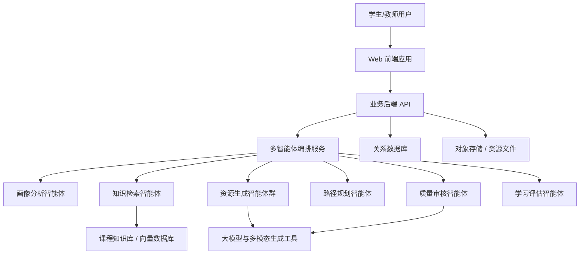

# 基于大模型的个性化资源生成与学习多智能体系统开发总体项目规划文档

> 适用赛题：第十五届中国软件杯 A3 赛题“基于大模型的个性化资源生成与学习多智能体系统开发”  
> 出题企业：科大讯飞股份有限公司  
> 文档版本：V1.0  
> 编制日期：2026 年 4 月 30 日  
> 参考来源：https://www.cnsoftbei.com/content-3-1286-1.html

## 1. 项目概述

本项目拟建设一套面向高校学生的个性化学习资源生成与学习多智能体系统，暂定名称为“智学工坊 EduAgent Studio”。系统以某一完整高校专业课程为切入点，建议初期选择“人工智能导论”或“机器学习基础”课程作为示范课程，构建课程知识库、学生学习画像、个性化资源生成链路和动态学习路径推荐能力。

项目面向高等教育中学习资源繁杂、资源与学生能力不匹配、课堂讲授难以兼顾个体差异等痛点，利用大模型、检索增强生成、多智能体协同、多模态内容生成和学习行为分析等技术，为学生自动生成个性化课程讲解文档、知识点思维导图、练习题、拓展阅读材料、实操案例、多模态讲解内容等学习资源，并通过动态画像与效果评估持续优化学习路径。

项目目标不仅是完成一个可演示系统，还要形成符合比赛要求的源码、数据集、模型配置、系统开发说明书、测试说明书、演示 PPT 和 7 分钟以内演示视频等完整交付物。

## 2. 建设目标

### 2.1 总体目标

围绕“因材施教”的数字化落地，构建一个可运行、可演示、可扩展的多智能体学习资源生成平台，实现从学生画像构建、知识库检索、资源生成、学习路径规划、学习反馈评估到资源推送的完整闭环。

### 2.2 业务目标

1. 降低学生筛选学习资源的成本，使系统能够根据学生基础、目标和偏好主动生成适配内容。
2. 提升学习资源的多样性和可理解性，支持文档、题库、思维导图、案例、视频脚本或动画脚本等多类型内容。
3. 支持学习过程中的持续反馈，根据学习行为和测评结果动态调整学习路径。
4. 为教师或课程建设者提供课程资源沉淀、资源质量审核和学生学习情况分析依据。

### 2.3 技术目标

1. 构建不少于 6 个维度的动态学生画像。
2. 设计清晰的多智能体协同架构，至少包含画像智能体、课程知识智能体、资源生成智能体、路径规划智能体、质量审核智能体等角色。
3. 实现至少 5 种个性化学习资源生成能力。
4. 建立防幻觉与内容安全机制，包括知识库引用、生成结果校验、敏感内容过滤和人工审核入口。
5. 提供流式输出、生成进度追踪、多模态内容卡片化展示等现代 AI 产品交互体验。

## 3. 需求理解与比赛要求映射

| 比赛要求 | 项目规划响应 |
| --- | --- |
| 对话式学习画像自主构建 | 通过自然语言对话采集学生专业、目标、学习历史、知识基础、认知风格、学习偏好、易错点等信息，自动抽取并更新画像 |
| 不少于 6 个画像维度 | 规划 8 个核心维度：专业背景、知识基础、学习目标、学习进度、认知风格、资源偏好、易错知识点、实践能力水平 |
| 多智能体协同 | 建立多角色智能体编排机制，每个智能体负责独立任务，并由协调智能体统一调度 |
| 至少 5 种资源生成 | 支持课程讲解文档、知识点思维导图、分层练习题、拓展阅读材料、代码实操案例、视频/动画讲解脚本等资源 |
| 个性化学习路径规划 | 根据画像、知识掌握度和资源结果生成阶段化学习路径，并随测试反馈动态调整 |
| 智能辅导加分项 | 规划即时问答、图解说明、代码解释、错题追问和短视频讲解脚本生成能力 |
| 学习效果评估加分项 | 规划学习行为追踪、练习测评、资源反馈和学习效果报告 |
| 防幻觉与内容安全 | 采用 RAG 引用、事实一致性检查、规则过滤、模型二次审核和人工确认机制 |
| 文档、PPT、演示视频、源码 | 将全部比赛交付物纳入项目里程碑和验收标准 |

## 4. 项目范围

### 4.1 范围内功能

1. 学生端
   - 对话式画像采集与确认
   - 个性化学习路径查看
   - 多类型资源生成与浏览
   - 智能问答与学习辅导
   - 练习测评与学习反馈

2. 管理端
   - 课程知识库管理
   - 资源生成任务管理
   - 学生画像与学习效果概览
   - 生成内容审核与发布
   - 模型、提示词和智能体配置管理

3. 智能体服务
   - 画像分析智能体
   - 知识检索智能体
   - 资源设计智能体
   - 练习题生成智能体
   - 案例生成智能体
   - 学习路径规划智能体
   - 内容审核智能体
   - 学习评估智能体

4. 数据与知识库
   - 至少一门完整高校专业课程的初始文档集
   - 课程章节、知识点、先修关系、难度标签
   - 学生画像、学习记录、测评结果和资源反馈

### 4.2 范围外功能

1. 不建设完整高校教务系统。
2. 不覆盖所有专业课程，初赛阶段以一门示范课程验证系统能力。
3. 不训练基础大模型，主要通过大模型 API、提示词工程、RAG 和智能体编排完成。
4. 不强制实现真实视频渲染生产线，初赛阶段可优先实现视频脚本、分镜、配音文本和可视化动画方案生成；若资源允许，再接入多模态生成工具。

## 5. 技术路线

### 5.1 总体技术架构

系统采用“前端应用 + 后端服务 + 多智能体编排 + 大模型能力 + 知识库 + 数据存储”的分层架构。

### 5.2 推荐技术选型

| 层级 | 推荐方案 | 说明 |
| --- | --- | --- |
| 前端 | Vue 3 / React + TypeScript | 实现流式输出、Markdown 渲染、内容卡片、学习路径视图 |
| 后端 | Python FastAPI / Java Spring Boot | 提供用户、课程、资源、智能体任务等接口 |
| 智能体编排 | LangGraph / AutoGen / 自研轻量编排器 | 明确多智能体协作流程，便于展示技术亮点 |
| 大模型 | 讯飞星火大模型及科大讯飞相关 AI 工具 | 符合赛题对科大讯飞相关工具的要求 |
| 知识库 | Markdown/PDF 文档解析 + Embedding + 向量数据库 | 支持课程资料检索增强生成 |
| 数据库 | PostgreSQL / MySQL | 存储用户、画像、任务、资源、测评结果 |
| 向量库 | Milvus / Chroma / FAISS | 存储课程知识片段向量 |
| 缓存与任务 | Redis + Celery/RQ | 支持异步生成、进度追踪和任务队列 |
| 文档渲染 | Markdown、Mermaid、PPTX 生成库 | 生成讲义、思维导图、PPT 结构和图表 |

### 5.3 关键技术方案

1. RAG 检索增强生成  
   将课程教材、课件、实验指导书、习题解析、参考文献等资料切分、清洗、向量化，生成学习资源时优先检索课程知识库，并在结果中保留知识来源，减少模型幻觉。

2. 多智能体协同  
   通过协调智能体拆解任务。例如学生输入“我想学习决策树但数学基础较弱”，系统先由画像智能体更新画像，再由知识检索智能体检索相关章节，资源设计智能体规划资源类型，讲解智能体生成通俗讲解，练习智能体生成分层题目，审核智能体进行事实和安全校验，路径规划智能体输出学习安排。

3. 动态学生画像  
   画像由显式信息和隐式行为共同构成。显式信息来自对话输入和确认，隐式信息来自学习时长、资源点击、题目正确率、追问记录和反馈评分。画像更新采用“抽取-确认-写入-版本记录”机制，避免错误画像影响后续推荐。

4. 个性化学习路径  
   根据知识点先修关系、学生目标、当前掌握度和资源偏好生成学习路径。路径包括学习阶段、知识点顺序、推荐资源、预计时长、阶段测评和调整策略。

5. 防幻觉与内容安全  
   生成内容需经过知识库引用检查、事实一致性检查、敏感词和违规内容过滤、提示词约束、模型二次审核以及教师审核入口。对无知识库依据的内容标记为“模型推断”，避免误导学生。

## 6. 功能模块规划

### 6.1 对话式学习画像模块

| 功能 | 说明 |
| --- | --- |
| 自然语言采集 | 学生通过聊天方式描述专业、目标、困难、偏好和学习经历 |
| 画像抽取 | 自动抽取画像字段，形成结构化数据 |
| 画像确认 | 学生可确认、修改或删除系统推断出的画像信息 |
| 动态更新 | 根据学习行为、练习结果和反馈持续更新 |
| 画像可视化 | 以雷达图、标签、进度条展示学生状态 |

核心画像维度包括：专业背景、知识基础、学习目标、学习进度、认知风格、资源偏好、易错知识点、实践能力水平。

### 6.2 课程知识库模块

1. 支持上传课程 PDF、PPT、Markdown、Word、代码文件和习题文档。
2. 自动抽取课程章节、知识点、关键词和摘要。
3. 维护知识点之间的先修关系和难度标签。
4. 支持知识片段检索、引用溯源和版本管理。

### 6.3 多智能体资源生成模块

| 资源类型 | 生成内容 | 个性化依据 |
| --- | --- | --- |
| 课程讲解文档 | 分层讲解、概念解释、示例说明 | 知识基础、认知风格 |
| 知识点思维导图 | Mermaid 或可视化节点结构 | 章节结构、知识关系 |
| 分层练习题 | 选择题、填空题、简答题、编程题 | 掌握度、易错点 |
| 拓展阅读材料 | 阅读清单、论文导读、学习建议 | 学习目标、兴趣方向 |
| 代码实操案例 | 实验步骤、样例代码、运行说明 | 专业方向、实践能力 |
| 视频/动画脚本 | 分镜、旁白、画面说明、演示流程 | 资源偏好、难点主题 |

### 6.4 个性化学习路径模块

1. 生成阶段化学习计划，如“基础补齐-核心概念-实践应用-综合测评”。
2. 为每个阶段匹配资源、任务、练习和验收标准。
3. 支持根据测评结果自动调整路径。
4. 提供学习进度、预计完成时间和下一步建议。

### 6.5 智能辅导模块

1. 支持学生对知识点、代码、题目和资源内容进行追问。
2. 支持多种回答形式：文字解释、步骤拆解、图解结构、伪代码、短视频讲解脚本。
3. 对不确定问题进行知识库检索，不足时提示需要补充资料。
4. 对代码类问题提供错误定位、原因解释和修改建议。

### 6.6 学习效果评估模块

1. 跟踪资源浏览、学习时长、练习正确率、错题类型和反馈评分。
2. 输出知识点掌握度、学习效率、资源适配度和风险预警。
3. 生成阶段学习报告，供学生和教师查看。
4. 将评估结果反馈给学习路径规划智能体，实现闭环优化。

## 7. 数据规划

### 7.1 初始课程知识库

建议选择“人工智能导论”作为初赛示范课程，构造以下材料：

1. 课程大纲：教学目标、章节安排、考核方式。
2. 章节资料：搜索、知识表示、机器学习、神经网络、自然语言处理、计算机视觉、大模型基础等。
3. 实验资料：Python 环境、数据预处理、分类模型训练、模型评估、小型问答系统实践。
4. 习题资料：概念题、计算题、编程题、综合应用题。
5. 拓展材料：经典论文、开源项目、行业应用案例。

### 7.2 核心数据表

| 数据对象 | 主要字段 |
| --- | --- |
| 用户信息 | 用户 ID、角色、专业、年级、注册时间 |
| 学生画像 | 画像维度、画像值、置信度、来源、更新时间 |
| 课程知识点 | 课程 ID、章节、知识点、难度、先修关系 |
| 知识片段 | 文档 ID、片段内容、向量 ID、来源页码 |
| 生成任务 | 任务 ID、资源类型、状态、进度、耗时、错误信息 |
| 学习资源 | 资源 ID、类型、内容、引用来源、审核状态 |
| 学习记录 | 用户 ID、资源 ID、学习时长、反馈、完成状态 |
| 测评记录 | 题目 ID、作答结果、知识点、得分、错因 |

## 8. 项目实施计划

在未明确比赛最终提交截止日期的情况下，项目按 8 周节奏规划；若实际周期更短，可优先保障核心功能与演示闭环。

| 阶段 | 时间 | 主要任务 | 阶段成果 |
| --- | --- | --- | --- |
| 第 1 阶段：需求与方案设计 | 第 1 周 | 赛题解读、用户调研、竞品分析、确定示范课程和技术路线 | 需求分析文档、原型草图、技术方案 |
| 第 2 阶段：知识库与基础框架 | 第 2 周 | 搭建前后端框架、数据库、课程知识库、文档解析与检索 | 可检索的课程知识库、基础系统框架 |
| 第 3 阶段：画像与对话入口 | 第 3 周 | 实现对话采集、画像抽取、画像确认和画像可视化 | 动态学生画像 MVP |
| 第 4 阶段：多智能体编排 | 第 4 周 | 完成协调智能体、知识检索智能体、资源生成智能体、审核智能体 | 多智能体协作主流程 |
| 第 5 阶段：资源生成能力 | 第 5 周 | 实现讲解文档、思维导图、练习题、拓展阅读、实操案例等资源生成 | 至少 5 类资源生成能力 |
| 第 6 阶段：路径规划与辅导评估 | 第 6 周 | 实现学习路径、智能问答、测评反馈和学习报告 | 个性化学习闭环 |
| 第 7 阶段：体验优化与安全机制 | 第 7 周 | 流式输出、进度追踪、内容卡片、防幻觉、安全过滤、性能优化 | 可稳定演示版本 |
| 第 8 阶段：测试与参赛材料 | 第 8 周 | 系统测试、Bug 修复、文档完善、PPT 和演示视频制作 | 初赛完整提交包 |

## 9. 团队分工规划

| 角色 | 主要职责 |
| --- | --- |
| 项目负责人 | 总体计划、进度协调、需求把关、答辩统筹 |
| 产品与文档负责人 | 用户调研、需求分析、原型设计、系统开发说明书、测试说明书 |
| 前端开发 | 学生端、管理端、资源展示、学习路径和可视化界面 |
| 后端开发 | API、数据库、任务队列、权限、文件管理和系统集成 |
| AI/算法开发 | RAG、智能体编排、提示词、画像抽取、资源生成和审核机制 |
| 测试与部署 | 功能测试、接口测试、性能测试、部署脚本、演示环境维护 |
| 视觉与演示材料 | PPT、演示视频脚本、系统截图、流程图和答辩材料 |

## 10. 测试规划

### 10.1 功能测试

1. 画像构建是否能从自然语言中正确抽取不少于 6 个维度。
2. 多智能体流程是否能完成任务拆解、检索、生成、审核和输出。
3. 至少 5 类资源是否能稳定生成并正确关联学生画像。
4. 学习路径是否能结合画像、知识点和测评结果动态调整。
5. 智能问答是否能引用知识库并避免无依据回答。

### 10.2 非功能测试

1. 界面兼容性：主流浏览器、不同屏幕尺寸。
2. 响应性能：普通文本生成支持流式输出；长任务提供进度追踪。
3. 稳定性：连续生成任务、异常输入、模型接口失败时系统可恢复。
4. 安全性：敏感内容过滤、用户数据隔离、接口鉴权。
5. 可维护性：日志、错误追踪、配置化提示词和智能体角色。

### 10.3 评测案例

| 案例 | 输入 | 预期输出 |
| --- | --- | --- |
| 数学基础薄弱学生学习决策树 | 学生说明数学基础薄弱、想掌握决策树 | 通俗讲解、图解、基础练习、路径建议 |
| 编程能力较强学生学习神经网络 | 学生偏好代码实践 | 代码案例、实验步骤、进阶阅读 |
| 错题集中在过拟合 | 测评结果显示相关错题较多 | 过拟合专题资源、针对性练习、学习路径调整 |
| 需要短视频讲解 | 学生偏好视频资源 | 分镜脚本、旁白、关键画面说明 |

## 11. 交付物规划

### 11.1 系统交付物

1. 可完整运行的项目源码。
2. 示例课程知识库与数据集。
3. 数据库初始化脚本。
4. 模型与智能体配置文件。
5. 部署说明和运行说明。
6. 演示账号与示例数据。

### 11.2 文档交付物

1. 系统开发说明书。
2. 需求分析说明书。
3. 总体设计说明书。
4. 数据库设计说明书。
5. 测试说明书与测试报告。
6. 开源项目、AI 工具和第三方依赖说明。
7. AI Coding 工具使用说明。

### 11.3 展示交付物

1. 演示 PPT：突出应用价值、AI 技术融合、创新点、核心功能和系统效果。
2. 演示视频：控制在 7 分钟以内，展示完整操作流程、资源生成效果、多智能体协作和多模态能力。
3. 架构图、流程图、功能截图和典型案例图表。

## 12. 创新点规划

1. 对话式画像替代表单式画像  
   通过自然语言交互降低学生使用门槛，并结合学习行为持续更新画像。

2. 多智能体协同生成学习资源  
   将课程分析、资源设计、内容生成、质量审核和路径规划拆分给不同智能体，提高系统可解释性和可展示性。

3. 面向课程知识库的可追溯生成  
   生成内容尽量关联知识库来源，增强可靠性，满足教育场景对准确性的要求。

4. 学习资源和学习路径一体化  
   不只生成单个资源，而是把资源纳入阶段化学习计划，形成完整学习闭环。

5. 多模态资源生成链路  
   支持文档、图谱、题库、代码案例、视频脚本等多形态输出，适配不同认知风格。

## 13. 风险与应对

| 风险 | 影响 | 应对措施 |
| --- | --- | --- |
| 大模型生成内容不准确 | 影响教育可信度 | 引入 RAG、引用来源、事实校验和审核智能体 |
| 多模态生成耗时较长 | 影响演示体验 | 使用异步任务、进度追踪、分阶段展示和结果缓存 |
| 功能范围过大 | 影响按期完成 | 优先完成核心闭环，智能辅导和效果评估按加分项逐步增强 |
| 知识库质量不足 | 影响资源生成质量 | 选定一门课程深度建设，确保章节、案例、习题完整 |
| 第三方工具协议不清 | 影响合规性 | 建立依赖清单，标注名称、来源、协议和用途 |
| 演示环境不稳定 | 影响比赛展示 | 准备本地演示数据、离线缓存结果和备用录屏 |

## 14. 质量与验收标准

1. 功能完整性  
   系统能够完成“画像构建-资源生成-路径规划-学习反馈”的核心流程。

2. 比赛符合度  
   满足不少于 6 个画像维度、至少 5 类资源生成、多智能体架构、文档规范、源码可运行等要求。

3. 技术可解释性  
   能够清晰展示每个智能体的职责、输入、输出和协作关系。

4. 用户体验  
   界面简洁清晰，支持流式输出、Markdown 渲染、生成进度和内容卡片展示。

5. 可靠性与安全性  
   具备防幻觉、内容安全、异常处理和基础权限控制。

6. 展示效果  
   PPT、演示视频和系统演示能够突出应用价值、创新性和完整度。

## 15. 初赛演示方案

建议演示围绕一个典型学生案例展开：

1. 学生进入系统，通过对话描述“我是计算机专业大二学生，想学习机器学习中的决策树，但数学基础一般，更喜欢图解和案例”。
2. 系统自动生成并展示学生画像，包括知识基础、学习目标、认知风格、资源偏好等维度。
3. 学生选择“生成学习资源”，多智能体开始协作，界面展示任务进度。
4. 系统生成课程讲解文档、思维导图、分层练习题、拓展阅读、代码实操案例和视频讲解脚本。
5. 系统根据画像生成一周学习路径，推荐学习顺序和每日任务。
6. 学生完成一次练习后，系统识别“信息增益计算”薄弱，自动调整路径并推荐补强资源。
7. 展示后台知识库、智能体配置、生成内容审核和测试结果。

## 16. 后续扩展方向

1. 扩展更多高校课程，形成跨课程知识图谱。
2. 接入真实教学平台数据，提升画像准确性。
3. 增强多模态生成能力，支持自动生成短视频、动画和互动实验。
4. 支持教师共创资源和班级级学习分析。
5. 建立资源质量评分体系，形成可持续迭代的学习资源生态。

## 17. 总结

本项目以高等教育个性化学习为核心场景，围绕中国软件杯 A3 赛题要求，规划建设一个融合大模型、多智能体、RAG、多模态生成和学习效果评估的智能学习系统。项目实施重点放在可运行系统、清晰技术架构、完整学习闭环、规范文档和高质量演示材料五个方面。通过该系统，参赛团队能够充分展示前沿 AI 技术在教育场景中的创新价值、实用性和工程落地能力。
